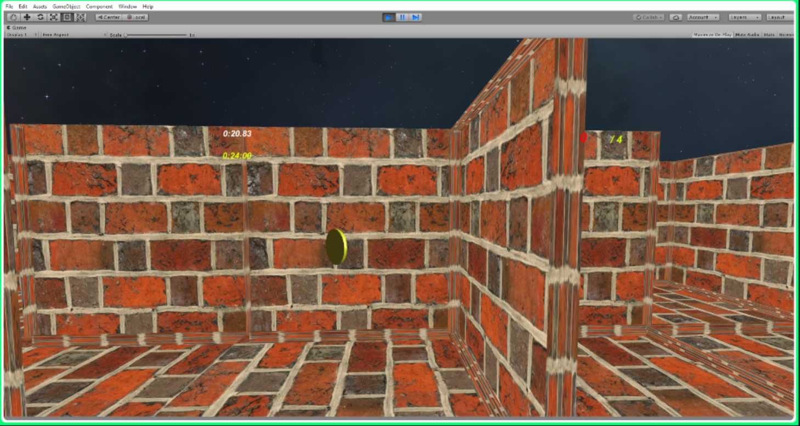

# MazeRunner

Creating a Maze Runner game using Unity

It creates a Maze environment using the hunt-and-kill algorithm. The game camera is always in the same position as the player (first person).
I added some materials for creating walls and coins. The game objective is to find some coins in the maze before the end time, which is also 
related to the number of coins and walls. By moving the player, if this player collides with a coin, i.e. the difference between the positions of the player and the coin are reaching zero, the coin will disappear and the player gains one coin.

