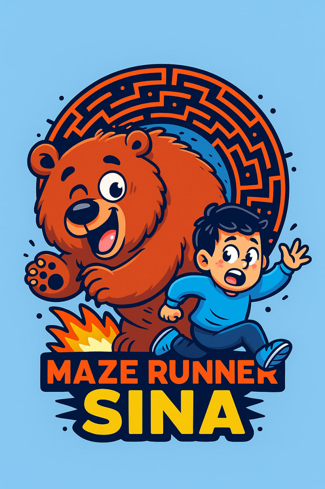

  

# 🎮 MazeRunner *Sina* Game 

A **first-person maze game** built with **Unity** and **C#**, where players navigate a procedurally generated maze to collect coins before time runs out.

## ✨ Features
- **Procedural Maze Generation**: Uses the **hunt-and-kill algorithm** to create unique mazes.
- **First-Person Perspective**: Camera follows the player for an immersive experience.
- **Objective**: Collect all coins within the time limit, which scales with the maze size and number of coins.
- **Collision Detection**: Coins disappear and increment the player's score upon collision.

### 🔎 What is the Hunt-and-Kill Algorithm?
A maze generation algorithm that starts with a grid of unvisited cells. It "hunts" for unvisited cells with visited neighbors, then "kills" (carves) a path between them, ensuring a fully connected maze. [wikipedia](https://en.wikipedia.org/wiki/Maze_generation_algorithm)

## 🛠️ Technologies
- **Unity**
- **C#**

## How to Play
1. Navigate the maze using standard movement controls.
2. Collect coins to increase your score.
3. Complete the game before time expires.

---
*More details coming soon!*

